# lap1
# DISCIPLINA: Laboratório de Pesquisa 1 - lap1

# TRABALHO 01:  Título do Trabalho
Trabalho desenvolvido durante a disciplina:

# Sumário

### 1. Componentes  
Integrantes do grupo 
Helen França Medeiros: helenfranca93@gmail.com 
Mayke Willans Christo Pereira: maykewillans@hotmail.com 
Lia Casati: liac.ramaldes@gmail.com
... 

### 2.Apresentação dos Datasets (Clássico + Em estudo) 
 Visão geral das bases de dados 

>#### 2.1 Visão geral da base de dados clássica: 

##### Titanic 
* Seus dados são sobre o que?
 **Resp**: O dataset Titanic possui informações sobre os passageiros presentes na embarcação.
* O que você deseja com este conjunto de dados?
 **Resp**: O objetivo é fazer uma análise sobre quais variáveis tiveram maior influência na probabilidade de sobrevivência, ou seja, que tipo de pessoa teve mais chance de escapar com vida.
* Quais são os tipos de atributos existentes e qual é o atributo alvo?
 **Resp**: Atributo alvo é a coluna **Survived**

| Atributo | Tipo | Significado |
| :------------ |:--------------|:---------|
| PassengerId  | Numérico discreto | Número de identificação do passageiro |
| Survived     | Categórico binário | Informa se o passageiro sobreviveu ao desastre |
| Pclass       | Categórico ordinal? | Classe do bilhete (1, 2 3) |
| Name       | Categórico nominal | Nome do passageiro |
| Sex       | Categórico nominal| Sexo do passageiro |
| Age       | Numérico contínuo| Idade do passageiro |
| SibSp       | Numérico discreto| Quantidade de cônjuges e irmãos a bordo |
| Parch       | Numérico discreto| Quantidade de pais e filhos a bordo |
| Ticket       | Categórico nominal| Número da passagem |
| Fare       | Numérico contínuo| Preço da Passagem |
| Cabin       | Categorico nominal| Número da cabine do passageiro |
| Embarked       | Categórico nominal| Porto no qual o passageiro embarcou (C = Cherbourg, Q = Queenstown, S = Southampton) |

* Quais são os problemas existentes?
 **Resp**: Incompletude(atributo ausente); Inconsistência(Fare)
* Qualidade e clareza:
 **Resp**: Não foi necessário renomear campos e colunas pois estava compreensível.

>#### 2.2 Visão geral da base de dados em estudo: 

### **Dataset Mania**
**Seus dados são sobre o que?**
 O dataset Mania possui informações informações relevantes para a detecção do transtorno comum mania.

**O que você deseja com este conjunto de dados?**
 O objetivo deste trabalho é fazer uma análise sobre quais variáveis têm maior influência na probabilidade de uma pessoa ter episódios de mania.

**Quais são os tipos de atributos existentes e qual é o atributo alvo?**
 Em geral, os tipos de atributos são:
- Dados nominais:
    >Exemplo: Tem problemas nas costas ou no pescoço? Resp.: 1(sim), 5(não), 8(não sabe) e 9(recusou)
- Dados discretos:
    >Exemplo: Qual a sua idade? Resp.: 18
- Dados binários:
    >Exemplo: Tem medo de insetos/animais? Resp.: 1(sim) ou 5(não)

Atributo alvo: **dsm_man**

**Quais são os problemas existentes?**
- Grande quantidade de valores ausentes;
- Registros sem significados ou informação relevante;
    >Exemplo: CC50C - Você está atualmente coberto por algum dos seguintes...
- Inconsistencia: existem colunas que se complementam, mas são interpretadas de forma diferente;
    >Exemplo: M6B1 (duração do episódio sendo muito irritável que se destaca) e M6B2 (Unidade de tempo), assim poderíamos ter: 2 dias, 2 meses, 2 anos, etc.
- Atributo alvo possui muitos valores de uma classe e poucos de outra;

**Qualidade e clareza: garantir que a semântica dos atributos seja clara (nomes coerentes com os dados, se necessário renomear atributos).**
  
### 3.Pré-processamento dos Datasets  

Realize o Pré-processamento e Tratamento de Dados em sua base/dataset.

>#### 3.1 Pré-processamento e tratamento na base de dados clássica: 

A imagem abaixo é um exemplo do conteúdo da base de dados Titanic e sua estatística

Muitas colunas(Age, Cabin, Embarked) apresentavam dados nulos e tratamos das maneiras a seguir. A coluna Fare notamos uma incoerência analisando o describe, e decidimos investigar também.

___
**Age**

Visando maior acerto na imputação dos dados, nos apoiamos na média de idade contando com duas variáveis: Sex e Title (coluna criada com o pronome de tratamento extraído do nome do passageiro. Para tal utilizados a função extrairTitulo())

Decidimos usar a coluna Sex a partir do resultado da média de idades diferentes para o tratamento de DR. No caso do sexo Feminino a média é de 49 anos e no sexo Masculino a média é de 40 anos.

Imputando os valores

___

**Cabin**

Com cerca de 77% de nulos

Os dados da coluna Cabin são conjuntos de letras e números. Abaixo utilizamos a primeira letra do campo para classificar em cada Classe.

Separando as cabines por classe, temos:

* Classe 1 - A, B, C, D, E, T
* Classe 2 - D, E, F
* Classe 3 - E, G, F

Vamos de forma randômica imputar esses dados por cada classe.

Por fim, vamos aplicar a técnica One-Hot Encoding na coluna Cabin. Como são dados categóricos e em pouca quantidade fica livre da 'maldição de dimensionalidade'

Resultado:

Como só temos 1 registro na cabine T, vamos desconsiderá-la do dataset

___

**Sex**

Substituindo

* Female por 1
* Male por 0

___

**Embarked**

Aqui também vamos aplicar a técnica One-Hot Encoding pelo mesmo motivo anterior.

___

**Fare**

Observando a coluna Fare pelo describe vimos que a média e mediana estão muito distantes. Possivelmente outliers, por isso decidimos investigar.

Como pode-se observar, existem muitos outliers. Nas próximas linhas vamos tratar essa questão.

* Contagem de pessoas que pagaram mais de 90 'dinheiros' de passagem

* Contagem de pessoas por classe

* Observações:
Tendo por base o gráfico tomamos o valor 90 como sendo o início dos outliers. Dessa maneira verificamos a quantidade de passageiros que haviam pago esse valor acima do normal e a qual classe pertenciam. Chegamos a conclusão que os passageiros que pagaram valores absurdos eram os da primeira classe, o que faz sentido já que essa é a classe mais cara na teoria - quanto melhor a classe, mais cara ela é. Porém esses pagaram valores muito diferentes dos outros.
De 216 passageiros na primeira classe, 57 pagaram um valor acima da média esperada.

* Abordagem utilizada:
Iremos utilizar a média de preço da primeira classe (retirando outliers) para consertar esses valores e não interferir nos resultados, trazendo a normalidade.

Desconfiamos que houvesse ainda uma distância entre os valores por conta dos passageiros que constam como passagem com valor zero, porém ao ver a quantidade percebemos que era bem baixa (15) se comparado com o número total de passageiros.

___

**Alguns ajustes:**

Apagando colunas com dados categóricos que não nos seriam úteis mais

___

**Versão final**

>#### 3.2 Pré-processamento e tratamento na base de dados em estudo: 
**Verificando valores nulos:**

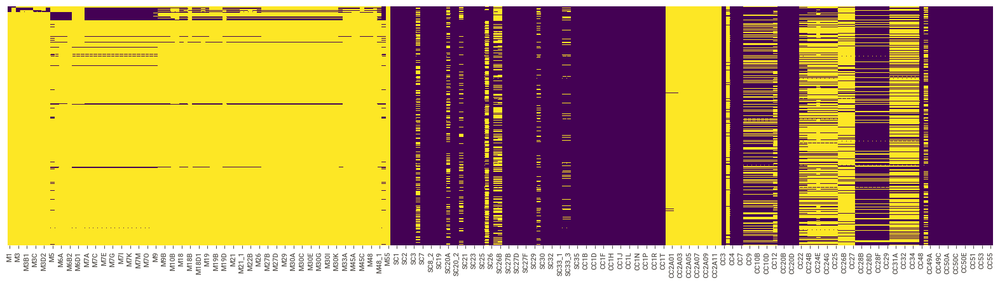

Podemos observar a presença de muitos valores nulos (representados em amarelo).

**Visualizando atributo alvo:**

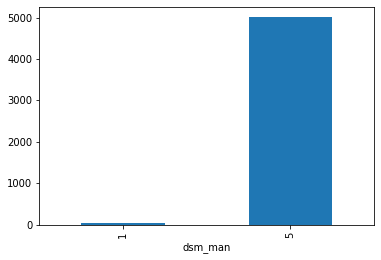

Podemos notar que o dataset possui muitos exemplos da classe 1 (sim) e poucos exemplos da classe 2 (não), precisaremos utilizar técnicas de balanceamento ou enriquecimento de dados para tratar a situação.

**Tratando valores nulos:**

Como encontramos muitos valores nulos, nossa ideia inicial foi tentar reduzir esses registros por meio da exclusão. Assim, excluímos colunas que apresentavam mais de 75% de valores nulos, como pode-se observar na imagem a seguir:

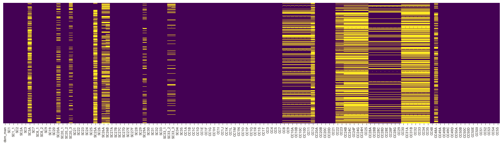

No entanto, percebemos que todas as colunas de M foram retiradas, então talvez não seja a melhor abordagem a se fazer.

A segunda opção foi analisar individualmente M, SC e CC.

Visualizando nulos em M:

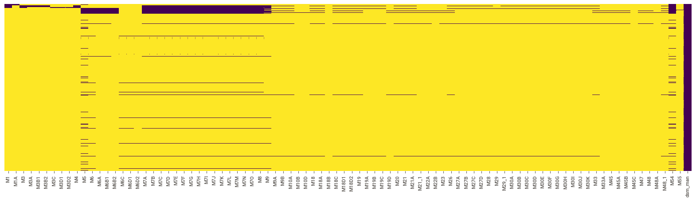

Visualizando nulos em SC:

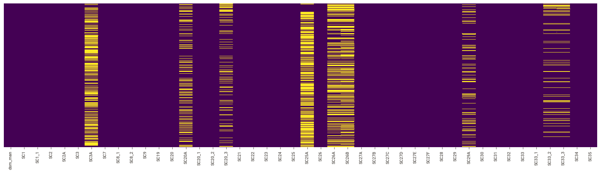

Visualizando nulos em CC:

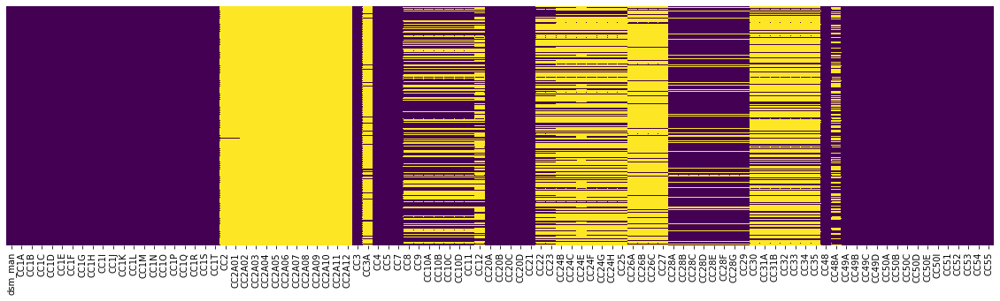

Neste dataset, as perguntas feitas pelo entrevistador podem mudar conforme as respostas dos entrevistados. Este fato se dá pois, ao obter determinada informação, o entrevistador realiza o diagnostico do entrevistado e procura fazer perguntas mais específicas para ter a possibilidade de detectar, por exemplo, um transtorno comum.
Com base nessas informações, vamos atribuir o valor 0 nos registros em M que não possuem valores.

Como ainda não possuímos muitas informações sobre a importância dos registros em SC e CC, vamos excluir colunas que possuem pelo menos 1 valor nulo.

Visualizando M:

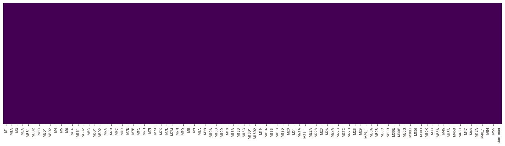

Visualizando SC:

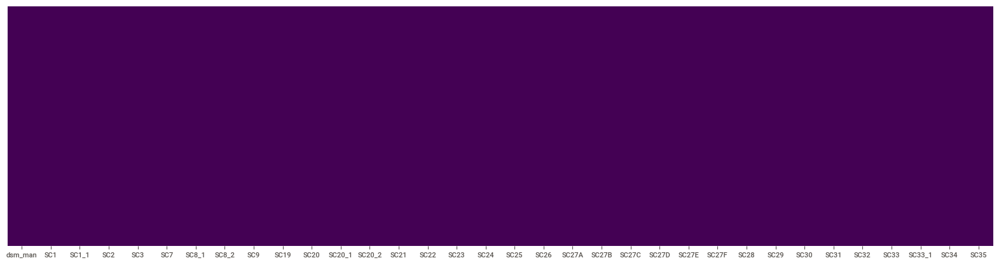

Visualizando CC:

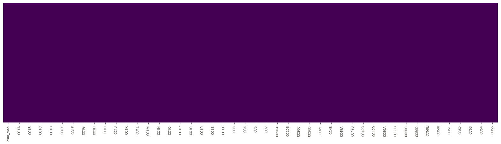
 

### 4.Análise Exploratória dos datasets 

>#### 4.1 Análise exploratória na base de dados clássica: 

A partir dos gráficos a seguir podemos inferir que:

* O número de mortos passou o de sobreviventes
* Morreram mais homens que mulheres
* A classe em que mais morreram pessoas foi a 3ª (Mediante a essas informações, porém se fizéssemos um balanceamento pode ser que a quantidade significativa mude).

Fizemos o uso do **Pandas Profiling**

O Pandas Profiling acusou cerca de 11.9% dos dados como duplicados. Retiramos e a nova e última versão do dataset é de 785 registros.

Além disso também acusou correlações entre algumas variáveis, porém não investigamos a fundo.

___

**PLUS**

Aplicamos o teste de predição e taxa foi de 79.42% de acurácia nos dados de treinamento e usando a parte não treinada foi de 72.58%.

Porém ao realizarmos o mesmo procedimento com a base sem retirar os duplicados, o resultado teve uma leve melhora na acurácia principalmente utilizando a faixa não treinada.

Resultados:

* Sem duplicados:

  * Treino: 79.42%
  * Sem Treino: 72.58%

* Com duplicados:

  * Treino: 79.64%
  * Sem treino: 79.82%

>#### 4.2 Análise exploratória na base de dados em estudo: 
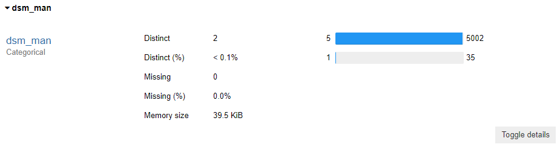

Como constatamos, o atributo alvo poderia ser tratado aplicando técnicas de balanceamento ou enriquecimento de dados.

Outro ponto a destacar é que podemos observar algumas correlações que podem ser utilizadas como técnicas de seleção de caracteríticas para escolher melhores atributos.

Visualizando correlações em M:

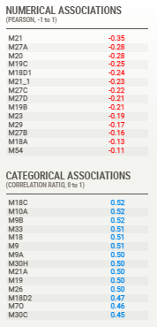

Visualizando correlações em SC:

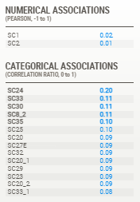

Visualizando correlações em CC:

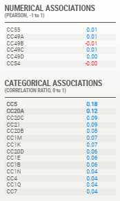

Por fim, analisando os dados coletados até aqui, uma possível análise para realizar posteriormente seria tratar cada atrituto individualmente, reduzindo a dimensionalidade e possibilitando uma melhor compreensão do dataset.

>Sugestão: Utilizar ferramentas como Pandas Proffile e Sweetviz , Seaborn e Matplotlib  
    
[Tutorial básico com Seaborn](https://github.com/profmoisesomena/escience_and_tools/blob/master/seaborn/Seaborn_introduction.ipynb "Seaborn Introduction")

># Marco de Entrega 01: Itens do Sprint 01  
    
### 5.Estudo dos algoritmos previamente definidos para a pesquisa
  (explicação/teoria) 
  >#### 5.1 Visão geral sobre cada um dos algoritmos: 
    A) Explicação sobre o algoritmo/método de classificação adotado
    (como funciona, performance/complexidade para treino e para execução, etc...)
    B) Estudar e apresentar exemplo de aplicações com algoritmos
    C) Existem requisitos/premissas necessárias para aplicação do algoritmo, quais são?
    D) Aplicar os modelos estudados em bases de dados clássicas como Iris/Titanic 
    (no caso de desejar utilizar outra base consultar o professor)
    
>#### 5.2 Qual dos algoritmos estudados (não visão do grupo, com base nos resultados obtidos) é o mais recomendado para a base de dados clássica utilizada (explicar): 
>...
>#### 5.3 Qual dos algoritmos estudados (não visão do grupo) provavelmente será o mais recomendado para a base de dados em estudo (explicar): 
>...

># Marco de Entrega 02: Itens do Sprint 02  
>

### 6.Implementar método no dataset em estudo  (explicação + datasets) 
    A) Explicação sobre o processo de aplicação dos algotítmos em estudo 
    no conjunto de dados em estudo (passos necessários/realizados)
    B) Implementar método nos datasets utilizados comparar resultados obtidos 
    e validar ou descartar hipótese do ítem 5.1 e 5.2.
    
>#### 6.1 Detalhamento dos processos de classificação com base nos algoritmos na base de dados em estudo: 
>...
>

### 7.Análise dos resultados obtidos  
    A) Detalhar conclusões com base nos resultados obtidos
    B) Definir quais trabalhos futuros podem ser realizados a partir das conclusões obtidas e tarefas realizadas.
    
>#### 7.1 Conclusões com base nos resultados obtidos: 
>...
>#### 7.2 Trabalhos futuros: 
>...
>
### 8. Resultados e Artefatos
>#### 8.1 Slides Finais
>#### 8.3 Demais artefatos solicitados pelo professor

># Marco de Entrega 03: Conclusão das atividades  

### 9 FORMATACAO NO GIT:  
https://help.github.com/articles/basic-writing-and-formatting-syntax/
<comentario no git>
    
##### About Formatting
    https://help.github.com/articles/about-writing-and-formatting-on-github/
    
##### Basic Formatting in Git
    
    https://help.github.com/articles/basic-writing-and-formatting-syntax/#referencing-issues-and-pull-requests
    
    
##### Working with advanced formatting
    https://help.github.com/articles/working-with-advanced-formatting/
#### Mastering Markdown
    https://guides.github.com/features/mastering-markdown/

    
### OBSERVAÇÕES IMPORTANTES

#### Todos os arquivos que fazem parte do projeto (Imagens, pdfs, arquivos fonte, etc..), devem estar presentes no GIT. Os arquivos do projeto vigente não devem ser armazenados em quaisquer outras plataformas.
1. <strong>Caso existam arquivos com conteúdos sigilosos<strong>, comunicar o professor que definirá em conjunto com o grupo a melhor forma de armazenamento do arquivo.

#### Todos os grupos deverão fazer Fork deste repositório e dar permissões administrativas ao usuário do git "profmoisesomena", para acompanhamento do trabalho.

#### Os usuários criados no GIT devem possuir o nome de identificação do aluno (não serão aceitos nomes como Eu123, meuprojeto, pro456, etc). Em caso de dúvida comunicar o professor.

Link para curso de GIT 

